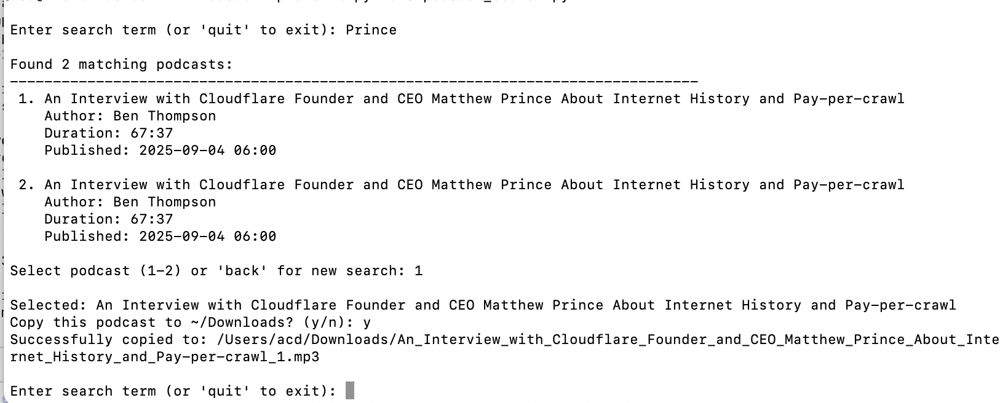

# PodcastExploreR

A Python command-line tool for searching and extracting podcasts from Apple's Podcasts app database on macOS.



## Features

- Search downloaded podcast episodes by title
- Display episode details including author, duration, and publication date
- Copy selected podcast files to your Downloads folder
- Interactive command-line interface

## Requirements

- Python 3.x
- macOS with Apple Podcasts app
- Downloaded podcast episodes in Apple Podcasts

## Usage

Run the script:

```bash
python3 podcast_search.py
```

The tool will prompt you to:
1. Enter a search term to find matching podcast episodes
2. Select an episode from the search results
3. Confirm copying the episode file to your Downloads folder

Type 'quit' to exit the program.

## How it Works

The tool searches Apple's Podcasts database located at:
`~/Library/Group Containers/243LU875E5.groups.com.apple.podcasts/Documents/MTLibrary.sqlite`

It queries the `ZMTEPISODE` table to find episodes matching your search term and copies the audio files to your Downloads directory with sanitized filenames.

## Notes

- Only works with downloaded podcast episodes (not streaming-only episodes)
- Requires access to Apple Podcasts database files
- File names are automatically sanitized for filesystem compatibility
- Duplicate files are handled by appending a counter to the filename